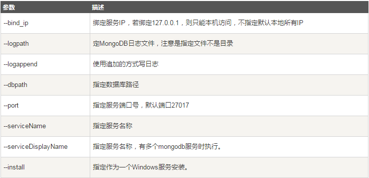
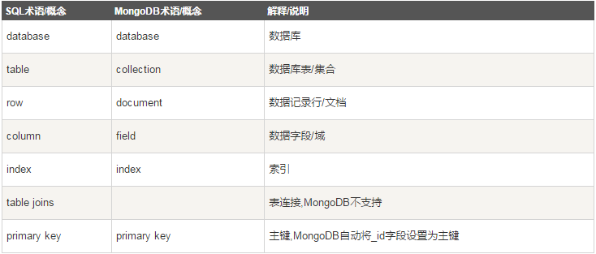
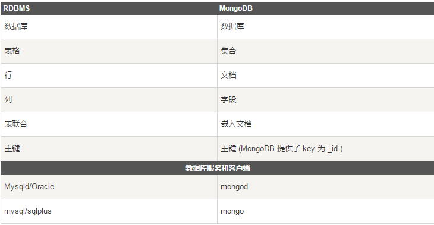

# 官网地址

https://www.mongodb.com/

#  MongoDB安装

使用.msi安装，安装完成后

创建data目录，并在下面创建db目录

用于存放MongoDB数据

## 测试方法

MongoDB目录的bin目录中执行mongod.exe文件下

cmd中

```
mongod.exe --dbpath c:\data\db
```

## 将MongoDB服务器作为Windows服务运行

使用管理员权限

```
mongod.exe --bind_ip yourIPadress --logpath "C:\data\dbConf\mongodb.log" --logappend --dbpath "C:\data\db" --port yourPortNumber --serviceName "YourServiceName" --serviceDisplayName "YourServiceName" --install
```

 

## linux下安装

```
curl -O https://fastdl.mongodb.org/linux/mongodb-linux-x86_64-3.0.6.tgz    # 下载
tar -zxvf mongodb-linux-x86_64-3.0.6.tgz                                   # 解压

mv  mongodb-linux-x86_64-3.0.6/ /usr/local/mongodb                         # 将解压包拷贝到指定目录
```

MongoDB 的可执行文件位于 bin 目录下，所以可以将其添加到 **PATH** 路径中：


```
export PATH=<mongodb-install-directory>/bin:$PATH
```

创建db目录

```
mkdir -p /data/db
```

## Mac OSX安装

```
# 进入 /usr/local
cd /usr/local

# 下载
sudo curl -O https://fastdl.mongodb.org/osx/mongodb-osx-x86_64-3.4.2.tgz

# 解压
sudo tar -zxvf mongodb-osx-x86_64-3.4.2.tgz

# 重命名为 mongodb 目录

sudo mv mongodb-osx-x86_64-3.4.2 mongodb
```

### 使用 brew 安装

此外你还可以使用 OSX 的 brew 来安装 mongodb：

```
sudo brew install mongodb
```

如果要安装支持 TLS/SSL 命令如下：

```
sudo brew install mongodb --with-openssl
```

安装最新开发版本：

```
sudo brew install mongodb --devel
```

```
sudo mkdir -p /data/db
```

```
sudo mongod

# 如果没有创建全局路径 PATH，需要进入以下目录
cd /usr/local/mongodb/bin
sudo ./mongod
```

# MongoDB概念

 

 

