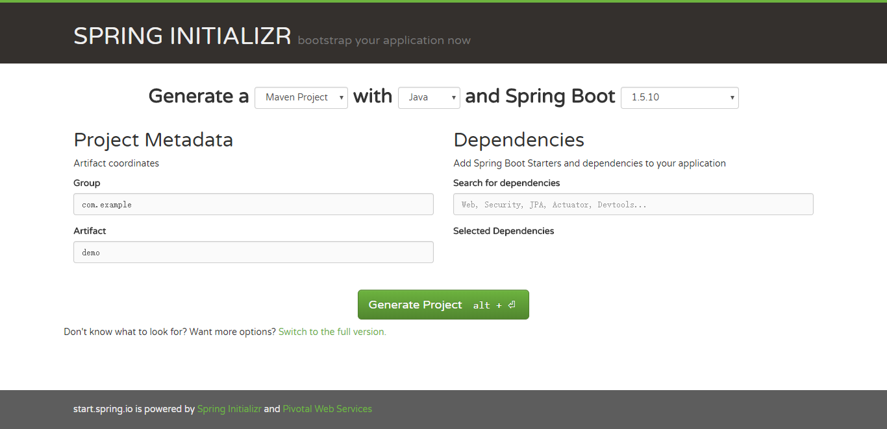
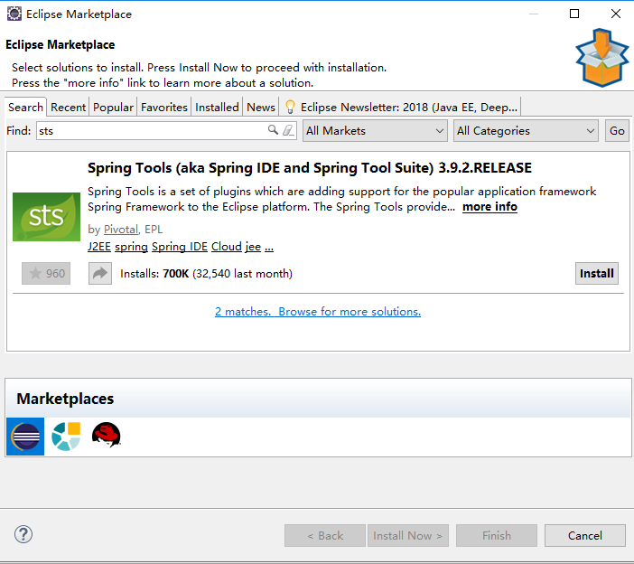
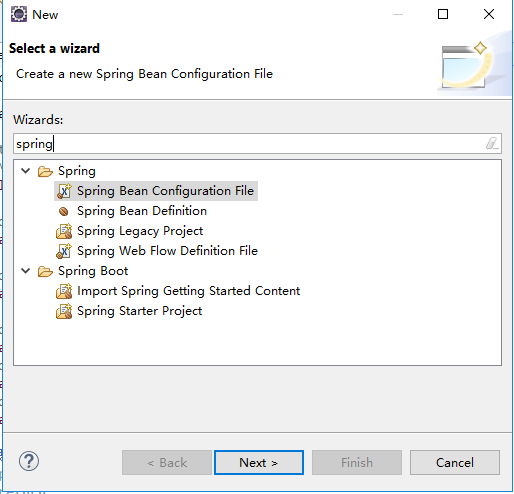
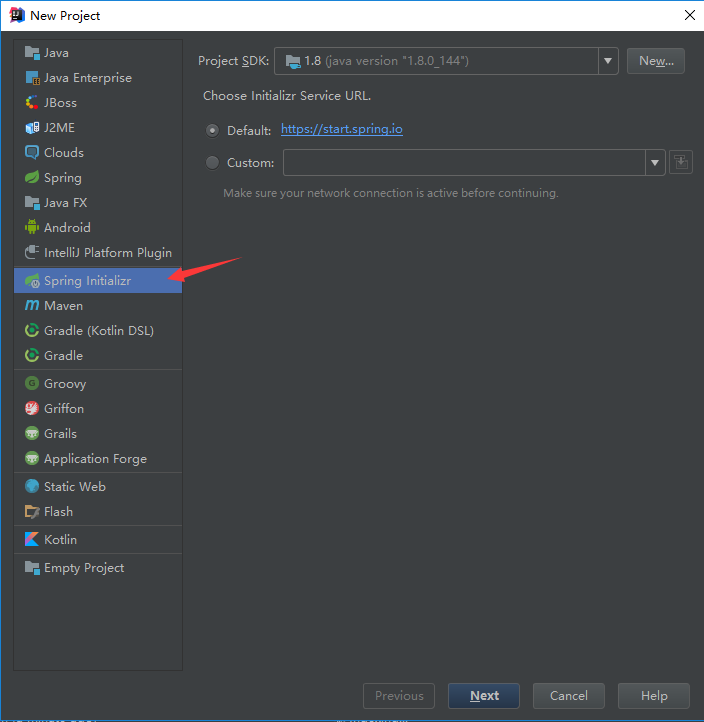
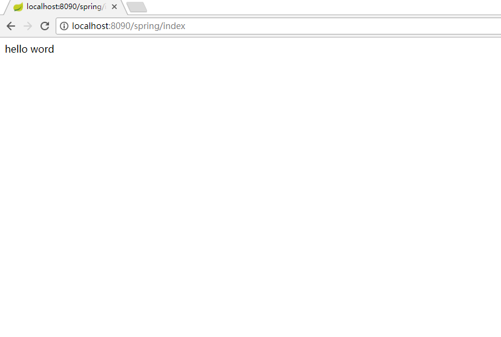

# 快速创建spring boot 工程

## 1.http://start.spring.io/



点击Generate Project 可下载springboot 程序，导入eclipse或者sts即可

## 2.eclipse

在eclipse的makert中搜索STS



点击install安装。

安装完成后可看到新建项目多了spring boot，选择Spring Starter Project，就可以快速创建springboot工程




## 3.使用[sts](http://spring.io/tools/sts/all)

根据自己的需求下载sts。

下载完成解压，运行sts-XXXXX下的STS.exe文件即可运行，sts界面与eclipse差不多，可直接创建spring boot工程

## 4.使用IDEA

新建工程，选择Spring Initalizr,可以看到默认他是到https://start.srping.io，之后界面就跟ecplise的相差不多



# spring boot 中的application.java

在本例中使用STS工具(第一次用。。)

```java
package com.example.demo;

import org.springframework.boot.SpringApplication;
import org.springframework.boot.autoconfigure.EnableAutoConfiguration;
import org.springframework.boot.autoconfigure.SpringBootApplication;
import org.springframework.context.annotation.ComponentScan;
import org.springframework.stereotype.Controller;
import org.springframework.web.bind.annotation.RequestMapping;
import org.springframework.web.bind.annotation.ResponseBody;

@SpringBootApplication
@ComponentScan
@Controller
@EnableAutoConfiguration
public class DemoApplication {

	public static void main(String[] args) {
		SpringApplication.run(DemoApplication.class, args);
	}

	@RequestMapping("/index")
	@ResponseBody
	public String index(){
		return "hello word";
	}
}
/*
1.5.10.RELEASE这个版本
我们使用工具生成是只有@SpringBootApplication这个注解，如果我们只使用这个注解无法访问/index，访问会    出404错误，需要加上 @ComponentScan @Controller @EnableAutoConfiguration这三个注解。
      添加完注解后，右键该java文件，run ‘DemoApplication’ 就可以运行。
      在运行之前请检查，8080端口是否被占用，如果被占用，可在application.properties文件中
      添加server.port=80801 或者任意未被占用的端口。
      需要注意:所有使用@Component注解的类，必须在DemoApplication的同级或者下一级才能被扫描到
*/

```

为了能让spring boot 热部署，在pom.xml中添加devtools的依赖

```xml
<dependency>
  <groupId>org.springframework.boot</groupId>
  <artifactId>spring-boot-devtools</artifactId>
</dependency>
```


# spring 中使用视图解析器

这里我们使用freemarker,使用spring boot 不推荐使用jsp。

首先添加freemarker的依赖包

```xml
<dependency>
    <groupId>org.springframework.boot</groupId>
    <artifactId>spring-boot-starter-freemarker</artifactId>
</dependency>
```

在appliction.properties中配置视图解析器

```properties
server.context-path=/spring
#前缀   在templates下新建folder名为ftl(IDEA是新建Directory名为ftl)
spring.freemarker.prefix=/ftl
#后缀
spring.freemarker.suffix=.ftl
#配置静态资源
spring.mvc.static-path-pattern=/**
spring.resources.static-locations=classpath:/static/
```

DemoApplication.java

```java
package com.example.demo;

import org.springframework.boot.SpringApplication;
import org.springframework.boot.autoconfigure.EnableAutoConfiguration;
import org.springframework.boot.autoconfigure.SpringBootApplication;
import org.springframework.context.annotation.ComponentScan;
import org.springframework.stereotype.Controller;
import org.springframework.web.bind.annotation.RequestMapping;

@SpringBootApplication
@ComponentScan
@Controller
@EnableAutoConfiguration
public class DemoApplication {

	public static void main(String[] args) {
		SpringApplication.run(DemoApplication.class, args);
	}
	@RequestMapping("/index")
	public String index(){
		return "/index";
	}
}
```

在ftl下新建index.ftl，并在其中输入 hello word

```ftl
hello word
```

打开浏览器输入http://localhost:8090/spring/index或者http://127.0.0.1:8090/spring/index



# 配置druid

添加依赖

```xml
<dependency>
      <groupId>com.alibaba</groupId>
      <artifactId>druid-spring-boot-starter</artifactId>
      <version>1.1.2</version>
</dependency>
```

本例中使用mysql

配置application.properties

```properties
#dataBaseName 换成自己的
# 数据库访问配置
spring.datasource.type=com.alibaba.druid.pool.DruidDataSource
spring.datasource.driver-class-name=com.mysql.jdbc.Driver
spring.datasource.url=jdbc:mysql://localhost:3306/dataBaseName?useUnicode=true&characterEncoding=utf-8&zeroDateTimeBehavior=convertToNull&useSSL=false
# 下面为连接池的补充设置，应用到上面所有数据源中
spring.datasource.druid.initial-size=5
spring.datasource.druid.min-idle=5
spring.datasource.druid.max-active=20
# 配置获取连接等待超时的时间
spring.datasource.druid.max-wait=60000
# 配置间隔多久才进行一次检测，检测需要关闭的空闲连接，单位是毫秒
spring.datasource.druid.time-between-eviction-runs-millis=60000
# 配置一个连接在池中最小生存的时间，单位是毫秒
spring.datasource.druid.min-evictable-idle-time-millis=300000
spring.datasource.druid.validation-query=SELECT 1 FROM DUAL
spring.datasource.druid.test-while-idle=true
spring.datasource.druid.test-on-borrow=false
spring.datasource.druid.test-on-return=false
# 配置监控统计拦截的filters，去掉后监控界面sql无法统计，'wall'用于防火墙
spring.datasource.druid.filters=stat,wall,log4j
spring.datasource.druid.filter.stat.log-slow-sql=true
```

在DemoApplication.java的同级，新建DruidConfig.java

```java
package com.example.demo;

import java.sql.SQLException;

import javax.sql.DataSource;

import org.slf4j.Logger;
import org.slf4j.LoggerFactory;
import org.springframework.beans.factory.annotation.Value;
import org.springframework.boot.web.servlet.FilterRegistrationBean;
import org.springframework.boot.web.servlet.ServletRegistrationBean;
import org.springframework.context.annotation.Bean;
import org.springframework.context.annotation.Configuration;

import com.alibaba.druid.pool.DruidDataSource;
import com.alibaba.druid.support.http.StatViewServlet;
import com.alibaba.druid.support.http.WebStatFilter;

@Configuration
public class DruidConfig {
    private Logger logger = LoggerFactory.getLogger(DruidConfig.class);

    @Value("${spring.datasource.url}")
    private String dbUrl;

    @Value("${spring.datasource.username}")
    private String username;

    @Value("${spring.datasource.password}")
    private String password;

    @Value("${spring.datasource.driver-class-name}")
    private String driverClassName;

    @Value("${spring.datasource.druid.initial-size}")
    private int initialSize;

    @Value("${spring.datasource.druid.min-idle}")
    private int minIdle;

    @Value("${spring.datasource.druid.max-active}")
    private int maxActive;

    @Value("${spring.datasource.druid.max-wait}")
    private int maxWait;

    @Value("${spring.datasource.druid.time-between-eviction-runs-millis}")
    private int timeBetweenEvictionRunsMillis;

    @Value("${spring.datasource.druid.min-evictable-idle-time-millis}")
    private int minEvictableIdleTimeMillis;

    @Value("${spring.datasource.druid.validation-query}")
    private String validationQuery;

    @Value("${spring.datasource.druid.test-while-idle}")
    private boolean testWhileIdle;

    @Value("${spring.datasource.druid.test-on-borrow}")
    private boolean testOnBorrow;

    @Value("${spring.datasource.druid.test-on-return}")
    private boolean testOnReturn;

    @Value("${spring.datasource.druid.filters}")
    private String filters;

    @Value("${spring.datasource.druid.filter.stat.log-slow-sql}")
    private String logSlowSql;

    @Bean
    public ServletRegistrationBean druidServlet() {
        ServletRegistrationBean reg = new ServletRegistrationBean();
        reg.setServlet(new StatViewServlet());
        reg.addUrlMappings("/druid/*");
        reg.addInitParameter("allow", "127.0.0.1");
        reg.addInitParameter("deny","192.168.15.210");
        reg.addInitParameter("loginUsername", "root");
        reg.addInitParameter("loginPassword", "root");
        reg.addInitParameter("logSlowSql", logSlowSql);
        return reg;
    }

    @Bean
    public FilterRegistrationBean filterRegistrationBean() {
        FilterRegistrationBean filterRegistrationBean = new FilterRegistrationBean();
        filterRegistrationBean.setFilter(new WebStatFilter());
        filterRegistrationBean.addUrlPatterns("/*");
        filterRegistrationBean.addInitParameter("exclusions", "*.js,*.gif,*.jpg,*.png,*.css,*.ico,/druid/*");
        filterRegistrationBean.addInitParameter("profileEnable", "true");
        return filterRegistrationBean;
    }

    @Bean
    public DataSource druidDataSource() {
        DruidDataSource datasource = new DruidDataSource();
        datasource.setUrl(dbUrl);
        datasource.setUsername(username);
        datasource.setPassword(password);
        datasource.setDriverClassName(driverClassName);
        datasource.setInitialSize(initialSize);
        datasource.setMinIdle(minIdle);
        datasource.setMaxActive(maxActive);
        datasource.setMaxWait(maxWait);
        datasource.setTimeBetweenEvictionRunsMillis(timeBetweenEvictionRunsMillis);
        datasource.setMinEvictableIdleTimeMillis(minEvictableIdleTimeMillis);
        datasource.setValidationQuery(validationQuery);
        datasource.setTestWhileIdle(testWhileIdle);
        datasource.setTestOnBorrow(testOnBorrow);
        datasource.setTestOnReturn(testOnReturn);
        try {
            datasource.setFilters(filters);
        } catch (SQLException e) {
            logger.error("druid configuration initialization filter", e);
        }
        return datasource;
    }

}
```

本例中使用mybaits

添加依赖

```xml
<dependency>
    <groupId>org.mybatis.spring.boot</groupId>
    <artifactId>mybatis-spring-boot-starter</artifactId>
    <version>1.3.1</version>
</dependency>
<dependency>
    <groupId>mysql</groupId>
    <artifactId>mysql-connector-java</artifactId>
    <scope>runtime</scope>
</dependency>
```

在application.properties中配置mybatis

```properties
mybatis.configuration.cache-enabled=true
mybatis.configuration.lazy-loading-enabled=true
mybatis.configuration.aggressive-lazy-loading=true
mybatis.configuration.multiple-result-sets-enabled=true
mybatis.configuration.use-column-label=true
mybatis.configuration.use-generated-keys=false
mybatis.configuration.auto-mapping-behavior=partial
mybatis.configuration.default-executor-type = simple
mybatis.configuration.default-statement-timeout=2500

```

在DemoApplication.java中添加注解@MapperScan

```java
package com.example.demo;

import org.mybatis.spring.annotation.MapperScan;
import org.springframework.boot.SpringApplication;
import org.springframework.boot.autoconfigure.EnableAutoConfiguration;
import org.springframework.boot.autoconfigure.SpringBootApplication;
import org.springframework.context.annotation.ComponentScan;
import org.springframework.stereotype.Controller;
import org.springframework.web.bind.annotation.RequestMapping;

@SpringBootApplication
@ComponentScan
@Controller
@EnableAutoConfiguration
@MapperScan("com.example.demo")
public class DemoApplication {

	public static void main(String[] args) {
		SpringApplication.run(DemoApplication.class, args);
	}
	@RequestMapping("/index")
	public String index(){
		return "/index";
	}
}

```

添加model类 user

