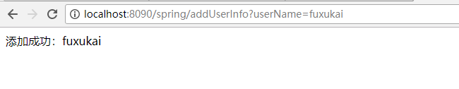
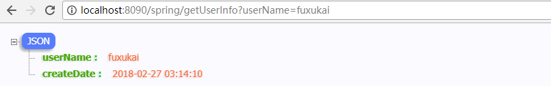
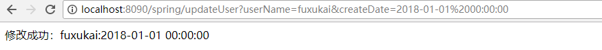
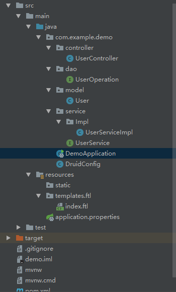

# 快速创建spring boot 工程

## 1.http://start.spring.io/


点击Generate Project 可下载springboot 程序，导入eclipse或者sts即可

## 2.eclipse

在eclipse的makert中搜索STS


点击install安装。

安装完成后可看到新建项目多了spring boot，选择Spring Starter Project，就可以快速创建springboot工程


## 3.使用[sts](http://spring.io/tools/sts/all)

根据自己的需求下载sts。

下载完成解压，运行sts-XXXXX下的STS.exe文件即可运行，sts界面与eclipse差不多，可直接创建spring boot工程

## 4.使用IDEA

新建工程，选择Spring Initalizr,可以看到默认他是到https://start.srping.io，之后界面就跟ecplise的相差不多


# spring boot 中的application.java

在本例中使用IDEA工具(第一次用。。)

```java
package com.example.demo;

import org.springframework.boot.SpringApplication;
import org.springframework.boot.autoconfigure.EnableAutoConfiguration;
import org.springframework.boot.autoconfigure.SpringBootApplication;
import org.springframework.context.annotation.ComponentScan;
import org.springframework.stereotype.Controller;
import org.springframework.web.bind.annotation.RequestMapping;
import org.springframework.web.bind.annotation.ResponseBody;

@SpringBootApplication
@ComponentScan
@Controller
@EnableAutoConfiguration
public class DemoApplication {

	public static void main(String[] args) {
		SpringApplication.run(DemoApplication.class, args);
	}

	@RequestMapping("/index")
	@ResponseBody
	public String index(){
		return "hello word";
	}
}
/*
1.5.10.RELEASE这个版本
我们使用工具生成是只有@SpringBootApplication这个注解，如果我们只使用这个注解无法访问/index，访问会    出404错误，需要加上 @ComponentScan @Controller @EnableAutoConfiguration这三个注解。
      添加完注解后，右键该java文件，run ‘DemoApplication’ 就可以运行。
      在运行之前请检查，8080端口是否被占用，如果被占用，可在application.properties文件中
      添加server.port=80801 或者任意未被占用的端口。
      需要注意:所有使用@Component注解的类，必须在DemoApplication的同级或者下一级才能被扫描到
*/

```

为了能让spring boot 热部署，在pom.xml中添加devtools的依赖

//在IDEA中还需配置其他的。。。用eclipse和STS 只需要右键项目，Spring Tools ->add Boot Devtools

```xml
<dependency>
  <groupId>org.springframework.boot</groupId>
  <artifactId>spring-boot-devtools</artifactId>
</dependency>
```


# spring 中使用视图解析器

这里我们使用freemarker,使用spring boot 不推荐使用jsp。

首先添加freemarker的依赖包

```xml
<dependency>
    <groupId>org.springframework.boot</groupId>
    <artifactId>spring-boot-starter-freemarker</artifactId>
</dependency>
```

在appliction.properties中配置视图解析器

```properties
server.context-path=/spring
#前缀   在templates下新建folder名为ftl(IDEA是新建Directory名为ftl)
spring.freemarker.prefix=/ftl/
#后缀
spring.freemarker.suffix=.ftl
#配置静态资源
spring.mvc.static-path-pattern=/**
spring.resources.static-locations=classpath:/static/
```

DemoApplication.java

```java
package com.example.demo;

import org.springframework.boot.SpringApplication;
import org.springframework.boot.autoconfigure.EnableAutoConfiguration;
import org.springframework.boot.autoconfigure.SpringBootApplication;
import org.springframework.context.annotation.ComponentScan;
import org.springframework.stereotype.Controller;
import org.springframework.web.bind.annotation.GetMapping;


@SpringBootApplication
@ComponentScan
@Controller
@EnableAutoConfiguration
public class DemoApplication {

	public static void main(String[] args) {
		SpringApplication.run(DemoApplication.class, args);
	}
	@GetMapping("/")
	public String home(){
		return  "index";
	}
}

```

在ftl下新建index.ftl，并在其中输入 hello word

```ftl
hello word
```

打开浏览器输入http://localhost:8090/spring/index或者http://127.0.0.1:8090/spring/index


# 配置druid

添加依赖

```xml
<dependency>
      <groupId>com.alibaba</groupId>
      <artifactId>druid-spring-boot-starter</artifactId>
      <version>1.1.2</version>
</dependency>
```

本例中使用mysql

配置application.properties

```properties
#dataBaseName 换成自己的
# 数据库访问配置
spring.datasource.type=com.alibaba.druid.pool.DruidDataSource
spring.datasource.driver-class-name=com.mysql.jdbc.Driver
spring.datasource.url=jdbc:mysql://localhost:3306/dataBaseName?useUnicode=true&characterEncoding=utf-8&zeroDateTimeBehavior=convertToNull&useSSL=false
# 下面为连接池的补充设置，应用到上面所有数据源中
spring.datasource.druid.initial-size=5
spring.datasource.druid.min-idle=5
spring.datasource.druid.max-active=20
# 配置获取连接等待超时的时间
spring.datasource.druid.max-wait=60000
# 配置间隔多久才进行一次检测，检测需要关闭的空闲连接，单位是毫秒
spring.datasource.druid.time-between-eviction-runs-millis=60000
# 配置一个连接在池中最小生存的时间，单位是毫秒
spring.datasource.druid.min-evictable-idle-time-millis=300000
spring.datasource.druid.validation-query=SELECT 1 FROM DUAL
spring.datasource.druid.test-while-idle=true
spring.datasource.druid.test-on-borrow=false
spring.datasource.druid.test-on-return=false
# 配置监控统计拦截的filters，去掉后监控界面sql无法统计，'wall'用于防火墙
spring.datasource.druid.filters=stat,wall,log4j
spring.datasource.druid.filter.stat.log-slow-sql=true
```

在DemoApplication.java的同级，新建DruidConfig.java

```java
package com.example.demo;

import java.sql.SQLException;

import javax.sql.DataSource;

import org.slf4j.Logger;
import org.slf4j.LoggerFactory;
import org.springframework.beans.factory.annotation.Value;
import org.springframework.boot.web.servlet.FilterRegistrationBean;
import org.springframework.boot.web.servlet.ServletRegistrationBean;
import org.springframework.context.annotation.Bean;
import org.springframework.context.annotation.Configuration;

import com.alibaba.druid.pool.DruidDataSource;
import com.alibaba.druid.support.http.StatViewServlet;
import com.alibaba.druid.support.http.WebStatFilter;

@Configuration
public class DruidConfig {
    private Logger logger = LoggerFactory.getLogger(DruidConfig.class);

    @Value("${spring.datasource.url}")
    private String dbUrl;

    @Value("${spring.datasource.username}")
    private String username;

    @Value("${spring.datasource.password}")
    private String password;

    @Value("${spring.datasource.driver-class-name}")
    private String driverClassName;

    @Value("${spring.datasource.druid.initial-size}")
    private int initialSize;

    @Value("${spring.datasource.druid.min-idle}")
    private int minIdle;

    @Value("${spring.datasource.druid.max-active}")
    private int maxActive;

    @Value("${spring.datasource.druid.max-wait}")
    private int maxWait;

    @Value("${spring.datasource.druid.time-between-eviction-runs-millis}")
    private int timeBetweenEvictionRunsMillis;

    @Value("${spring.datasource.druid.min-evictable-idle-time-millis}")
    private int minEvictableIdleTimeMillis;

    @Value("${spring.datasource.druid.validation-query}")
    private String validationQuery;

    @Value("${spring.datasource.druid.test-while-idle}")
    private boolean testWhileIdle;

    @Value("${spring.datasource.druid.test-on-borrow}")
    private boolean testOnBorrow;

    @Value("${spring.datasource.druid.test-on-return}")
    private boolean testOnReturn;

    @Value("${spring.datasource.druid.filters}")
    private String filters;

    @Value("${spring.datasource.druid.filter.stat.log-slow-sql}")
    private String logSlowSql;

    @Bean
    public ServletRegistrationBean druidServlet() {
        ServletRegistrationBean reg = new ServletRegistrationBean();
        reg.setServlet(new StatViewServlet());
        reg.addUrlMappings("/druid/*");
        reg.addInitParameter("allow", "127.0.0.1");
        reg.addInitParameter("deny","192.168.15.210");
        reg.addInitParameter("loginUsername", "root");
        reg.addInitParameter("loginPassword", "root");
        reg.addInitParameter("logSlowSql", logSlowSql);
        return reg;
    }

    @Bean
    public FilterRegistrationBean filterRegistrationBean() {
        FilterRegistrationBean filterRegistrationBean = new FilterRegistrationBean();
        filterRegistrationBean.setFilter(new WebStatFilter());
        filterRegistrationBean.addUrlPatterns("/*");
        filterRegistrationBean.addInitParameter("exclusions", "*.js,*.gif,*.jpg,*.png,*.css,*.ico,/druid/*");
        filterRegistrationBean.addInitParameter("profileEnable", "true");
        return filterRegistrationBean;
    }

    @Bean
    public DataSource druidDataSource() {
        DruidDataSource datasource = new DruidDataSource();
        datasource.setUrl(dbUrl);
        datasource.setUsername(username);
        datasource.setPassword(password);
        datasource.setDriverClassName(driverClassName);
        datasource.setInitialSize(initialSize);
        datasource.setMinIdle(minIdle);
        datasource.setMaxActive(maxActive);
        datasource.setMaxWait(maxWait);
        datasource.setTimeBetweenEvictionRunsMillis(timeBetweenEvictionRunsMillis);
        datasource.setMinEvictableIdleTimeMillis(minEvictableIdleTimeMillis);
        datasource.setValidationQuery(validationQuery);
        datasource.setTestWhileIdle(testWhileIdle);
        datasource.setTestOnBorrow(testOnBorrow);
        datasource.setTestOnReturn(testOnReturn);
        try {
            datasource.setFilters(filters);
        } catch (SQLException e) {
            logger.error("druid configuration initialization filter", e);
        }
        return datasource;
    }

}
```

# 添加mybaits

添加依赖

```xml
<dependency>
    <groupId>org.mybatis.spring.boot</groupId>
    <artifactId>mybatis-spring-boot-starter</artifactId>
    <version>1.3.1</version>
</dependency>
<dependency>
    <groupId>mysql</groupId>
    <artifactId>mysql-connector-java</artifactId>
    <scope>runtime</scope>
</dependency>
```

# 添加model类 user

```java
package com.example.demo.model;

public class User {
    private String userName;
    private String createDate;

    public String getUserName() {
        return userName;
    }

    public void setUserName(String userName) {
        this.userName = userName;
    }

    public String getCreateDate() {
        return createDate;
    }

    public void setCreateDate(String createDate) {
        this.createDate = createDate;
    }
}
```

# 编写DAO

```java
package com.example.demo.dao;

import com.example.demo.model.User;
import org.apache.ibatis.annotations.*;
import org.springframework.stereotype.Repository;

@Repository
@Mapper
public interface UserOperation {
    @Select("select username,createdate from t_userinfo where username= #{userName}")
    @Results({
            @Result(property = "userName",  column = "username"),
            @Result(property = "createDate", column = "createdate"),
    })
    User getUserByUserName(String userName);

    @Insert("insert into t_userinfo(username,createdate) values(#{userName},#{createDate})")
    int addUser(User user);

    @Update("update t_userinfo set createdate = #{createDate} where username = #{userName}")
    int updateUser(User user);

    @Delete("delete from t_userinfo where username = #{userName}")
    int deleteUser(String userName);
}

```

# 编写Service接口

```java
package com.example.demo.service;

import com.example.demo.model.User;

public interface UserService {
    /**
     * 根据用户名获取用户信息
     * @param userName
     * @return
     */
    public User getUserInfo(String userName);

    /**
     * 添加用户
     * @param user
     * @return
     */
    int addUser(User user);

    /**
     * 修改用户信息
     * @param user
     * @return
     */
    int updateUser(User user);

    /**
     * 删除用户信息
     * @param userName
     * @return
     */
    int deleteUser(String userName);
}

```

# 编写Service实现层

```java
package com.example.demo.service.Impl;

import com.example.demo.dao.UserOperation;
import com.example.demo.service.UserService;
import org.springframework.beans.factory.annotation.Autowired;
import org.springframework.stereotype.Service;
import com.example.demo.model.User;

@Service
public class UserServiceImpl implements UserService {

    @Autowired
    private UserOperation uo;

    @Override
    public User getUserInfo(String userName) {
        return uo.getUserByUserName(userName);
    }

    @Override
    public int addUser(User user) {
        return uo.addUser(user);
    }

    @Override
    public int updateUser(User user) {
        return uo.updateUser(user);
    }

    @Override
    public int deleteUser(String userName) {
        return uo.deleteUser(userName);
    }
}

```

# 编写controller层

```java
package com.example.demo.controller;

import com.example.demo.model.User;
import com.example.demo.service.UserService;
import org.springframework.beans.factory.annotation.Autowired;
import org.springframework.web.bind.annotation.GetMapping;
import org.springframework.web.bind.annotation.RestController;

import java.text.SimpleDateFormat;
import java.util.Date;

@RestController
public class UserController {

    @Autowired
    private UserService userService;

    @GetMapping("/getUserInfo")
    public User getUserInfo(String userName){
        if(userName==null||userName.trim()==""){
            return null;
        }
        return userService.getUserInfo(userName);
    }

    @GetMapping("/addUserInfo")
    public String addUser(User user){
        User u = userService.getUserInfo(user.getUserName());
        if(u!=null){
            return user.getUserName()+"已存在";
        }
        user.setCreateDate(new SimpleDateFormat("yyyy-MM-dd hh:mm:ss").format(new Date()));
        int i = userService.addUser(user);
        if(i>0) {
            return "添加成功：" + user.getUserName();
        }
        return "添加失败："+user.getUserName();
    }
    @GetMapping("/updateUser")
    public String updateUser(User user){
        User u = userService.getUserInfo(user.getUserName());
        if(u==null){
            return user.getUserName()+"用户不存在";
        }
        int i = userService.updateUser(user);
        if(i>0) {
            return "修改成功：" + user.getUserName()+":"+user.getCreateDate();
        }
        return "修改失败："+user.getUserName()+":"+user.getCreateDate();
    }

    @GetMapping("/deleteUser")
    public String deleteUser(String userName){
        User u = userService.getUserInfo(userName);
        if(u==null){
            return userName+"用户不存在";
        }
        int i = userService.deleteUser(userName);
        if(i>0) {
            return "删除成功：" + userName;
        }
        return "删除失败："+userName;
    }
｝
```

# 测试

## 添加用户



## 查询用户



## 修改用户

//时间格式应该为2018-01-01 00:00:00 

//%20是浏览器空格自动转的



## 删除用户


# 附录

## pom.xml

```xml
<?xml version="1.0" encoding="UTF-8"?>
<project xmlns="http://maven.apache.org/POM/4.0.0" xmlns:xsi="http://www.w3.org/2001/XMLSchema-instance"
	xsi:schemaLocation="http://maven.apache.org/POM/4.0.0 http://maven.apache.org/xsd/maven-4.0.0.xsd">
	<modelVersion>4.0.0</modelVersion>

	<groupId>com.example</groupId>
	<artifactId>demo</artifactId>
	<version>0.0.1-SNAPSHOT</version>
	<packaging>jar</packaging>

	<name>demo</name>
	<description>Demo project for Spring Boot</description>

	<parent>
		<groupId>org.springframework.boot</groupId>
		<artifactId>spring-boot-starter-parent</artifactId>
		<version>1.5.10.RELEASE</version>
		<relativePath/> <!-- lookup parent from repository -->
	</parent>

	<properties>
		<project.build.sourceEncoding>UTF-8</project.build.sourceEncoding>
		<project.reporting.outputEncoding>UTF-8</project.reporting.outputEncoding>
		<java.version>1.8</java.version>
	</properties>

	<dependencies>
		<dependency>
			<groupId>org.springframework.boot</groupId>
			<artifactId>spring-boot-starter-web</artifactId>
		</dependency>

		<dependency>
			<groupId>org.springframework.boot</groupId>
			<artifactId>spring-boot-starter-test</artifactId>
			<scope>test</scope>
		</dependency>

		<dependency>
			<groupId>org.springframework.boot</groupId>
			<artifactId>spring-boot-devtools</artifactId>
            <optional>true</optional>
            <scope>true</scope>
		</dependency>
        <dependency>
            <groupId>org.springframework.boot</groupId>
            <artifactId>spring-boot-starter-freemarker</artifactId>
        </dependency>
		<dependency>
			<groupId>com.alibaba</groupId>
			<artifactId>druid-spring-boot-starter</artifactId>
			<version>1.1.2</version>
		</dependency>
		<dependency>
			<groupId>org.mybatis.spring.boot</groupId>
			<artifactId>mybatis-spring-boot-starter</artifactId>
			<version>1.3.1</version>
		</dependency>
		<dependency>
			<groupId>mysql</groupId>
			<artifactId>mysql-connector-java</artifactId>
			<scope>runtime</scope>
		</dependency>
	</dependencies>

	<build>
		<plugins>
			<plugin>
				<groupId>org.springframework.boot</groupId>
				<artifactId>spring-boot-maven-plugin</artifactId>
                <configuration>
                    <fork>
                        true
                    </fork>
                </configuration>
			</plugin>
		</plugins>
	</build>
</project>

```

## 目录结构

