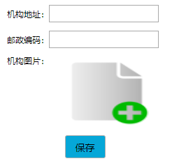

# 关于ajax如何传图片和参数

1.html部分

```html
<label class="tag" for="file" style="vertical-align: top;">机构图片：</label>
<input  type="file" id="fileimg" style="display: none" accept='image/gif,image/jpeg,image/jpg,image/png'  />

<div style="text-align: center;">
  <input type="button" class="easyui-linkbutton" value="保存" id="insertBranch">
</div>
```



2.js 显示图片

```javascript

	$("#branchimg").click(function(){
		 $("#fileimg").click();
		 $("#fileimg").change(function(){
			var objUrl = getObjectURL(this.files[0]) ; //获取图片的路径，该路径不是图片在本地的路径
			if (objUrl) {
				$("#branchimg").attr("src", objUrl) ;
				}
			})
		
	});
	function getObjectURL(file) {
		var url = null ;
		if (window.createObjectURL!=undefined) { // basic
		url = window.createObjectURL(file) ;
		} else if (window.URL!=undefined) { // mozilla(firefox)
		url = window.URL.createObjectURL(file) ;
		} else if (window.webkitURL!=undefined) { // webkit or chrome
		url = window.webkitURL.createObjectURL(file) ;
		}
		return url ;
		}


```


```javascript
        var fd = new FormData();
		fd.append("fileToUpload", $("#fileimg")[0].files[0]);//图片
	    fd.append("address", $("#BranchAddress").val().replace("<", "&lt;"));
	    fd.append("zipCode", $("#BranchZipCode").val().replace("<", "&lt;"));
		$.ajax({
			type : "POST",
			url : "../branch/addBranch",
			data : fd,
			processData: false,
	         contentType: false,
	         dataType :"json",
			success : function(data) {
				if (data.flag) {
					branch.children=[];
					$('#addBranchDiv').window("close");
					$.messager.show({timeout :3000,title :'提示信息',msg :'操作成功!'});
					$('#BranchTreeTemplateId').treegrid('append',{
						parent: branch.fatherBranchNo,
						data: [branch]
					});
					
				}else{
					$.messager.alert('添加', data.msg, 'error');
				}
			},
			error: function(XMLHttpRequest, textStatus, errorThrown){
				$.messager.alert("系统提示", "网络异常");
			}
		});
```

